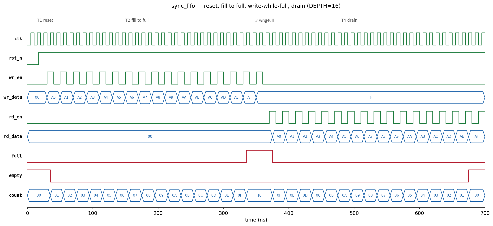

# Parameterized Synchronous FIFO (Verilog)

[](https://github.com/AshakiranaV/sync-fifo/actions/workflows/sim.yml)

Single-clock FIFO with configurable data width and depth, programmable almost-full/almost-empty thresholds, and a self-checking scoreboard testbench. Verified with Icarus Verilog; simulation runs in CI on every push.

## Specification

| Parameter | Value |
|---|---|
| `DATA_WIDTH` | configurable (default 8) |
| `DEPTH` | configurable, **must be a power of 2** (default 16) |
| `ALMOST_FULL_LVL` | `almost_full` asserts at `count >= LVL` (default `DEPTH-2`) |
| `ALMOST_EMPTY_LVL` | `almost_empty` asserts at `count <= LVL` (default 2) |
| Reset | active-low, asynchronous |
| Read latency | 1 cycle (registered output) |
| Flags | `full`, `empty`, `almost_full`, `almost_empty`, `count` |

## Project structure

```
rtl/sync_fifo.v        FIFO RTL
tb/tb_sync_fifo.v      self-checking testbench (scoreboard-based)
docs/waveform.png      simulation waveform
Makefile               sim / wave / synth / clean targets
.github/workflows/     CI: runs the testbench on every push
```

## Design notes

**Pointers are `ADDR_WIDTH+1` bits wide.** With plain address-width pointers, `wr_ptr == rd_ptr` is ambiguous — it means *empty* after a drain and *full* when the writer has lapped the reader exactly once. The extra MSB acts as a wrap bit:

- all bits equal → same lap → **empty**
- low bits equal, MSB differs → writer one lap ahead → **full**

This is why `DEPTH` must be a power of two — the low bits have to wrap exactly at the array boundary.

**Occupancy** is `wr_ptr - rd_ptr`; two's-complement subtraction handles the wrap case with no conditional logic. The threshold flags are simple comparators on `count`.

**Illegal accesses are guarded internally.** A write while `full` or a read while `empty` is dropped rather than corrupting the pointers.

**Read is synchronous** — `rd_data` is valid the cycle *after* `rd_en`. This is not a first-word-fall-through FIFO.

## Verification

| Test | Covers |
|---|---|
| 1 | Flag state after reset |
| 2 | Fill to `full` |
| 3 | Write-while-full is ignored |
| 4 | Drain in FIFO order, data integrity |
| 5 | Read-while-empty is ignored |
| 6 | Simultaneous read + write, steady occupancy |
| 7 | Pointer wraparound over 2.5×`DEPTH` transactions |
| 8 | `almost_full` / `almost_empty` assert exactly at their thresholds |

The testbench keeps a software scoreboard queue alongside the DUT — every value read out is compared against the queue, so data integrity is checked on every single pop, not just at test boundaries.

```bash
make sim      # compile + run testbench (iverilog/vvp)
make wave     # open build/fifo.vcd in GTKWave
make synth    # Yosys synth_xilinx + resource stats
```

### Simulation output

```
Test 1 (reset flags)           : PASS
Test 2 (fill to full)          : PASS
Test 3 (write-while-full)      : PASS
Test 4 (drain, data integrity) : PASS
Test 5 (read-while-empty)      : PASS
Test 6 (simultaneous rd+wr)    : PASS
Test 7 (pointer wraparound)    : PASS
Test 8 (almost flags)          : PASS
ALL TESTS PASSED
```

### Waveform

Reset → fill to full (A0–AF) → write-while-full dropped (`FF` never enters, `count` holds at 0x10) → in-order drain to empty:



## Synthesis (Yosys, `synth_xilinx`, default 16×8 config)

| Resource | Count |
|---|---|
| Estimated logic cells | 69 |
| LUTs (LUT2–LUT6) | 80 |
| Flip-flops | 146 (128 FDRE memory + 18 FDCE pointers/output reg) |
| CARRY4 | 6 |

Yosys maps the 16×8 memory array to registers rather than block RAM at this depth — expected for a FIFO this small; larger depths would infer distributed or block RAM in Vivado.

## Future work

- Asynchronous (dual-clock) variant with Gray-code pointers and 2-flop synchronizers
- Formal property checks with SymbiYosys (no overflow, no underflow, `full && empty` never both asserted)

## Author

Ashakirana V — B.E. Electronics and Communication Engineering, CMR Institute of Technology (VTU), Bengaluru

MIT licensed.
